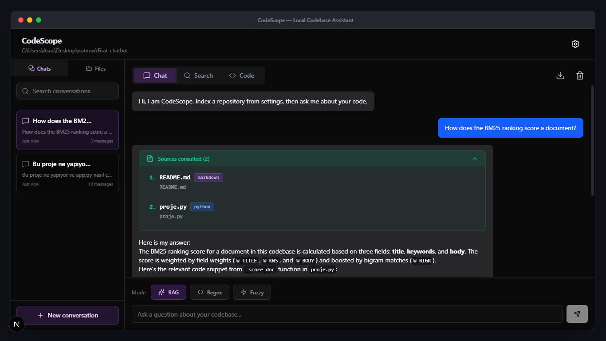
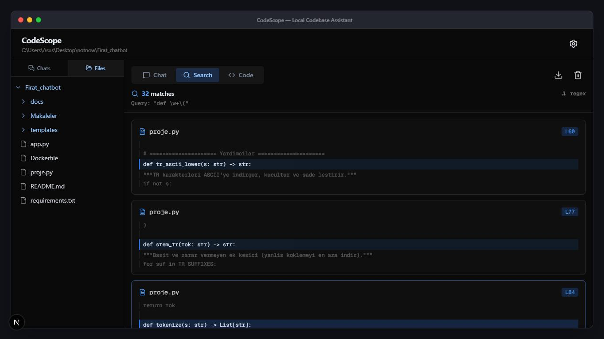
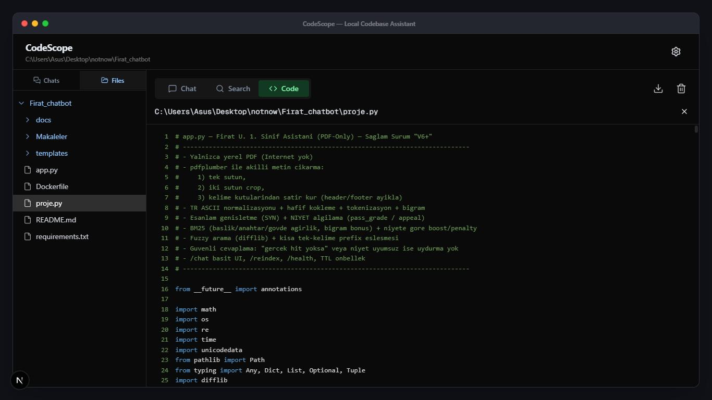
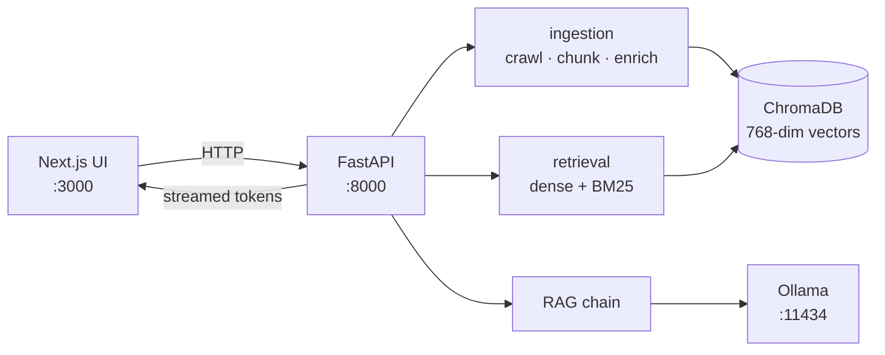

<div align="center">

# CodeScope

**Ask questions about your codebase. Nothing leaves your machine.**

A local-first RAG assistant that indexes a repository and answers questions about it
using an LLM running on your own hardware.

[](https://github.com/Yigtwxx/CodeScope/actions/workflows/ci.yml)
[](https://codecov.io/gh/Yigtwxx/CodeScope)
[](LICENSE)
[](https://www.python.org/downloads/)
[](https://nextjs.org/)

</div>

---

## Screenshots

**Grounded chat.** Every answer lists the files it was derived from, and each
citation opens that file in the built-in viewer. Conversations are kept in the
left rail.



**Regex search.** Full regular-expression search across the repository, with
surrounding context lines on every match.



**Explorer and code viewer.** Browse the indexed repository and read any file
with syntax highlighting, without leaving the app.



## Why

Cloud coding assistants require uploading proprietary source code to a third party.
For many teams that is a non-starter — not because the tools are bad, but because
the data policy makes them unusable.

CodeScope runs the entire pipeline locally: file crawling, chunking, embedding,
vector storage and generation. There is no API key to configure and no outbound
request to a model provider. The only network traffic is between your browser,
a FastAPI process on `localhost:8000`, and an Ollama process on `localhost:11434`.

## Features

| | |
|---|---|
| **Grounded chat** | Ask a question in natural language; answers cite the files they were derived from, and each citation opens in the built-in viewer. |
| **Hybrid retrieval** | Dense vector similarity fused with BM25 keyword scoring, so both "how does auth work?" and `UserRepositoryImpl` return useful context. |
| **Regex search** | Full regular-expression search across the repository with surrounding context lines. |
| **Fuzzy search** | Typo-tolerant search powered by RapidFuzz — `authentiction` still finds `authenticate`. |
| **Code intelligence** | tree-sitter parses Python, JavaScript, TypeScript, Go, Rust, Java and C# to attach function, class, interface, struct, trait and record declarations to each indexed chunk. |
| **File explorer** | Browse the indexed repository and read files with syntax highlighting, without leaving the app. |
| **Conversation history** | Multiple threads, auto-titled from your first question, searchable and renameable. Everything stays in the browser. |
| **Export** | Save a conversation as Markdown, JSON or PDF. |
| **Hardware aware** | Embeddings run on CUDA, Apple Silicon (MPS) or CPU, selected automatically. |

## Architecture



Full request lifecycles, sequence diagrams and a module map live in
[docs/architecture.md](docs/architecture.md). The reasoning behind the
non-obvious choices — and what each one costs — is in
[docs/decisions.md](docs/decisions.md).

### How indexing works

1. **Crawl** — walk the repository, pruning `node_modules`, `.git`, build output and
   lock files; skip binaries by checking for a NUL byte in the first 8 KB.
2. **Chunk** — split each file with a syntax-aware `RecursiveCharacterTextSplitter`
   (1000 characters, 200 overlap) so a function is rarely severed from its body.
3. **Enrich** — parse supported languages with tree-sitter and attach the declarations
   that appear in each chunk to its metadata.
4. **Embed & store** — encode chunks with `multilingual-e5-base` into 768-dimensional
   vectors and write them to ChromaDB in batches.

### How answering works

1. **Retrieve** — run the question through both dense vector search and a BM25 index,
   then fuse the two score sets (70/30 by default) and take the top 8 chunks.
2. **Ground** — assemble the chunks into a labelled context block, capped at 12,000
   characters so long repositories cannot overflow the model's context window.
3. **Generate** — stream the answer token by token from Ollama through FastAPI to the UI.

## Requirements

| Dependency | Version | Notes |
|---|---|---|
| [Python](https://www.python.org/downloads/) | 3.10+ | Tested on 3.11 and 3.12 |
| [Node.js](https://nodejs.org/) | 20+ | Tested on 22 |
| [Ollama](https://ollama.com/) | latest | Required for chat; search and browsing work without it |

Roughly 8 GB of disk space is needed for the embedding model and the `qwen3.5:9b`
weights. A GPU is optional but makes both noticeably faster.

## Setup

```bash
git clone https://github.com/Yigtwxx/CodeScope.git
cd CodeScope
```

### Option A — Docker

Brings up Ollama, the backend and the frontend together. Docker Desktop or
Docker Engine with Compose v2 is the only prerequisite.

```bash
# Mount the directory that holds the repositories you want to index.
# On Windows PowerShell use $env:WORKSPACE = "C:\Users\you\code"
WORKSPACE=~/code docker compose up --build

# Once Ollama is healthy, pull a model (one time; it persists in a volume).
docker compose exec ollama ollama pull qwen3.5:9b
```

Open <http://localhost:3000> and index `/workspace/<repository-name>`.

> The container can only see what you mounted. `WORKSPACE` is mapped read-only
> to `/workspace`, and that is also the sandbox root, so repositories outside it
> are not reachable from the Docker setup. Embeddings run on CPU in the
> container — use the native setup below for GPU acceleration.

If any of those ports is already taken, override them:

```bash
FRONTEND_PORT=3100 BACKEND_PORT=8100 OLLAMA_PORT=11534 \
  WORKSPACE=~/code docker compose up --build
```

### Option B — Native

**1. Pull a model**

```bash
ollama pull qwen3.5:9b
```

**2. Backend**

```bash
# Windows
python -m venv .venv
.venv\Scripts\activate

# macOS / Linux
python3 -m venv .venv
source .venv/bin/activate

pip install -r backend/requirements.txt
```

**3. Frontend**

```bash
cd frontend
npm install
cd ..
```

**4. Run**

```bash
# Windows
run_app.bat

# macOS / Linux
./run_app.sh
```

Or start each side yourself:

```bash
# Terminal 1 (with the virtualenv activated)
cd backend && python -m uvicorn main:app --reload --port 8000

# Terminal 2
cd frontend && npm run dev
```

`npm run dev:all` starts both from one terminal, but it invokes plain `python`,
so activate the virtualenv first. The launcher scripts above do that for you.

Open <http://localhost:3000>.

## Usage

1. Click the **gear icon**, enter the absolute path to a local repository, and press
   **Index repository**. Progress streams into the dialog.
2. Once indexing finishes, pick a mode and ask away:
   - **RAG** — natural-language questions answered from the indexed code
   - **Regex** — exact pattern matching, e.g. `class \w+Service`
   - **Fuzzy** — typo-tolerant keyword search
3. Click any search result or answer citation to open that file in the **Code** tab.

Indexing replaces the previous repository — CodeScope holds one codebase at a time.

## Configuration

Copy the example files and edit what you need. Every value has a working default.

```bash
cp backend/.env.example backend/.env
cp frontend/.env.example frontend/.env.local
```

### Backend (`backend/.env`)

| Variable | Default | Description |
|---|---|---|
| `LOG_LEVEL` | `INFO` | Standard Python log levels |
| `ALLOWED_ORIGINS` | `http://localhost:3000,http://127.0.0.1:3000` | Comma-separated CORS allowlist |
| `WORKSPACE_ROOT` | your home directory | **Sandbox root.** Paths outside it are rejected |
| `CHROMA_DB_DIR` | `backend/chroma_db` | Where vectors are persisted |
| `RESET_DB_ON_STARTUP` | `false` | Wipe the index on every server start |
| `EMBEDDING_MODEL_NAME` | `intfloat/multilingual-e5-base` | Any sentence-transformers model. Changing it discards the index |
| `EMBEDDING_QUERY_PROMPT` / `EMBEDDING_DOCUMENT_PROMPT` | `query: ` / `passage: ` | Task prefixes the e5 family requires; blank for models that take none |
| `EMBEDDING_TRUST_REMOTE_CODE` | `false` | Runs code shipped with the model. Enable only for a model you trust |
| `EMBEDDING_DEVICE` | `auto` | `auto` resolves CUDA → MPS → CPU; or pin `cuda`/`mps`/`cpu` |
| `CHUNK_SIZE` / `CHUNK_OVERLAP` | `1000` / `200` | Chunking window in characters |
| `RETRIEVAL_TOP_K` | `8` | Chunks passed to the model as context |
| `SEMANTIC_WEIGHT` / `BM25_WEIGHT` | `0.7` / `0.3` | Hybrid fusion weights |
| `OLLAMA_BASE_URL` | `http://localhost:11434` | Ollama endpoint |
| `OLLAMA_MODEL` | `qwen3.5:9b` | Any model you have pulled |
| `OLLAMA_TEMPERATURE` | `0.1` | Low values keep answers grounded |
| `OLLAMA_NUM_CTX` | `8192` | Context window. Ollama's own default of 4096 is too small for a grounded prompt plus its answer |
| `OLLAMA_NUM_PREDICT` | `1024` | Maximum reply length, so an answer always finishes inside the window |
| `OLLAMA_REASONING` | `false` | Hybrid reasoning models stream their thinking on a channel the UI never shows. Leave off unless you are inspecting the raw stream |

> **`WORKSPACE_ROOT` is a security boundary.** The API reads files from disk on
> request, so it constrains every path to this directory. Widen it deliberately,
> and do not expose the backend beyond `localhost`.

### Choosing models

The defaults target a machine with roughly 8 GB of VRAM: `qwen3.5:9b` for
generation and `multilingual-e5-base` for retrieval, which fit side by side.

Retrieval measured on this repository — 256 chunks from 37 files, 28 labelled
queries, 20 English and 8 Turkish, on an RTX 4070:

| `EMBEDDING_MODEL_NAME` | Params | Dim | MRR | chunks/s | Notes |
|---|---:|---:|---:|---:|---|
| `Qwen/Qwen3-Embedding-0.6B` | 596M | 1024 | **0.818** | 39 | Best retrieval; needs ~2.4 GB, so pair it with a smaller chat model |
| `intfloat/multilingual-e5-base` | 278M | 768 | 0.743 | 154 | **Default.** Needs the `query: ` / `passage: ` prefixes |
| `intfloat/multilingual-e5-small` | 118M | 384 | 0.654 | 304 | Same prefixes, half the width |
| `sentence-transformers/all-MiniLM-L6-v2` | 22M | 384 | 0.638 | 484 | Fastest and smallest; blank both prompts. English only |

Code-specialised encoders were measured too and are deliberately not the default:
they score no better on English queries here and fail on non-English ones. See
[docs/decisions.md](docs/decisions.md#the-embedding-model-is-multilingual-not-code-specialised).

Changing `EMBEDDING_MODEL_NAME` makes the stored vectors meaningless, so
CodeScope discards the index and logs that a re-index is needed.

For generation, anything you have pulled works. `qwen3-coder:30b` explains code
noticeably better if you have the memory; the default `qwen3.5:9b` is the
lighter option and still follows citations well.

> **GPU acceleration.** `pip install torch` gives a CPU-only build, which makes
> embedding roughly 12x slower. On an NVIDIA card, install the CUDA build
> instead — check `GET /health` afterwards, it reports the device actually in
> use:
>
> ```bash
> pip install --upgrade --index-url https://download.pytorch.org/whl/cu128 torch
> ```

### Frontend (`frontend/.env.local`)

| Variable | Default | Description |
|---|---|---|
| `NEXT_PUBLIC_API_URL` | `http://localhost:8000` | Backend base URL |

## API

Interactive docs are served at <http://localhost:8000/docs> while the backend runs.

| Method | Endpoint | Description |
|---|---|---|
| `GET` | `/health` | Service status, indexed chunk count, active embedding device |
| `POST` | `/api/ingest` | Index a repository; streams progress as plain text |
| `POST` | `/api/chat` | Ask a question; streams the grounded answer |
| `POST` | `/api/search/regex` | Regular-expression search |
| `POST` | `/api/search/fuzzy` | Fuzzy search with a similarity threshold |
| `POST` | `/api/files/list` | List a directory's contents |
| `POST` | `/api/files/content` | Read a file, truncated at 1 MB |

<details>
<summary>Example</summary>

```bash
curl -N -X POST http://localhost:8000/api/chat \
  -H "Content-Type: application/json" \
  -d '{"message": "How is authentication handled?"}'
```

</details>

## Project layout

```
CodeScope/
├── backend/
│   ├── app/
│   │   ├── api/            # Routers and Pydantic schemas
│   │   ├── core/           # Settings, logging, device selection, path sandbox
│   │   ├── db/             # ChromaDB access (cached embeddings)
│   │   └── services/       # Ingestion, retrieval, search, AST parsing, prompts
│   ├── scripts/            # Developer utilities
│   ├── tests/              # pytest suite
│   ├── main.py             # FastAPI entry point
│   └── requirements.txt
├── frontend/
│   ├── app/
│   │   ├── components/     # Chat, explorer, search, viewer, settings, export
│   │   ├── hooks/          # Chat, search, viewer and conversation state
│   │   ├── lib/            # API client, citation parser, storage helpers
│   │   └── types/
│   ├── components/ui/      # shadcn/ui primitives
│   ├── tests/              # vitest suite
│   └── package.json
├── docs/                   # Architecture, design decisions, screenshots
├── docker-compose.yml
└── .github/workflows/      # CI, CodeQL, Dependabot
```

## Development

```bash
# Backend
cd backend
pip install -r requirements-dev.txt
ruff check .            # lint
ruff format .           # format
pytest -q               # runs with coverage; fails below the configured floor

# Frontend
cd frontend
npm run format:check
npm run lint
npm run typecheck
npm run test:coverage
npm run build
```

CI runs all of the above on every push and pull request. Lint, type, test and
coverage failures block the build — `next.config.ts` deliberately does **not**
suppress them, and both suites enforce a coverage floor.

Inspect the vector store directly:

```bash
cd backend && python -m scripts.inspect_db --limit 5
```

## Troubleshooting

<details>
<summary><b>"Ollama is not reachable"</b></summary>

The backend could not connect to `OLLAMA_BASE_URL`. Confirm Ollama is running
(`ollama list`) and that the model is pulled (`ollama pull qwen3.5:9b`).
</details>

<details>
<summary><b>"Path is outside the allowed workspace root"</b></summary>

The repository you selected lives outside `WORKSPACE_ROOT`. Set that variable in
`backend/.env` to a directory that contains it, then restart the backend.
</details>

<details>
<summary><b>"No repository indexed yet"</b></summary>

The vector store is empty. Open settings and index a repository. If you set
`RESET_DB_ON_STARTUP=true`, the index is cleared on every restart.
</details>

<details>
<summary><b>Indexing finds no files</b></summary>

Only recognised source extensions are indexed, and `node_modules`, `.git`, build
output and lock files are skipped. Check that the path points at the repository
root rather than a build directory.
</details>

<details>
<summary><b>Embeddings are slow</b></summary>

Check `GET /health` — `embedding_device` reports what was selected. A CPU-only
torch build always reports `cpu`; install a CUDA build of torch for GPU
acceleration.
</details>

## Limitations

- One repository is indexed at a time; indexing a new one replaces the old index.
  Conversation history is kept, but answers are always grounded in whatever is
  currently indexed.
- Answer quality is bounded by the local model. `qwen3.5:9b` is the default
  because it fits in 8 GB of VRAM; `qwen3-coder:30b` explains code noticeably
  better if you have the memory for it.
- Code intelligence covers Python, JavaScript, TypeScript, Go, Rust, Java and C#.
  Other languages are still indexed and searchable, just without declaration
  metadata.
- Conversations live in browser storage, so they are per-browser and not shared
  between machines.
- Designed for local use. It has no authentication and should not be exposed to a
  network.

## Contributing

Issues and pull requests are welcome. [CONTRIBUTING.md](CONTRIBUTING.md) covers
the checks a PR has to pass and the conventions this codebase follows.

## License

MIT — see [LICENSE](LICENSE).
