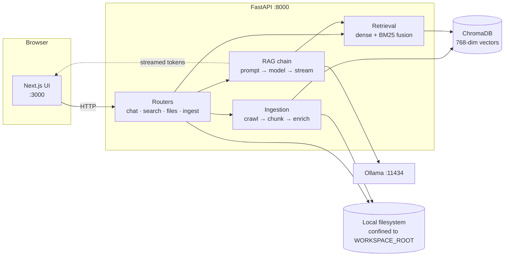
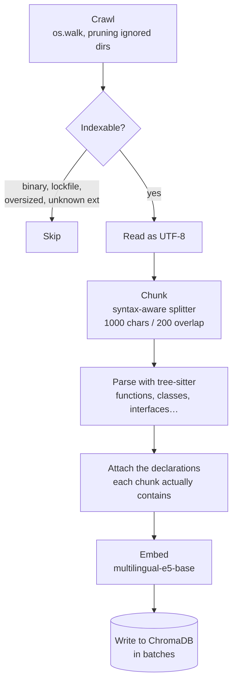
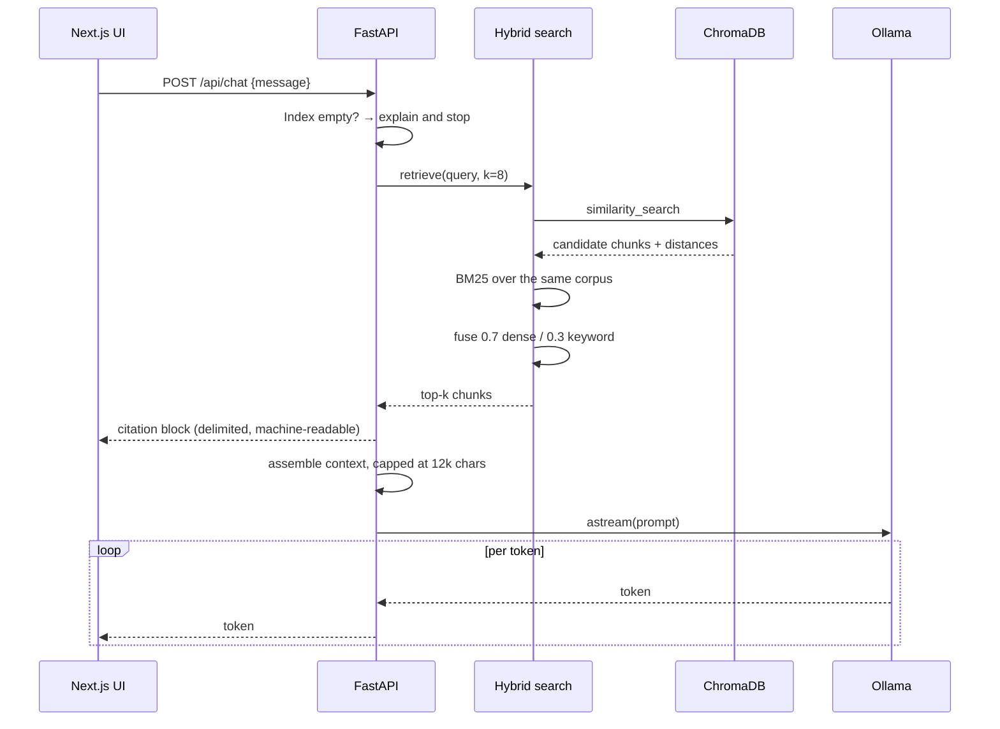

# Architecture

CodeScope is two processes and two data stores. Everything runs on the machine
that starts it; nothing is sent to a third party.

## Components

## Indexing a repository

`POST /api/ingest` streams progress as plain text so a multi-minute job reports
what it is doing instead of blocking silently.

Directories are pruned during the walk rather than filtered afterwards, so
`node_modules` is never descended into. Binaries are detected by looking for a
NUL byte in the first 8 KB — cheaper and more reliable than trusting the
extension.

## Answering a question

The citation block is emitted **before** the answer, so the UI can render the
sources panel while the model is still generating. It is delimited by
`<!--codescope:sources-->` markers and parsed in
[`frontend/app/lib/citations.ts`](../frontend/app/lib/citations.ts); the backend
side lives in [`backend/app/services/rag.py`](../backend/app/services/rag.py).
Both sides have tests pinning the format.

## Module map

| Path | Responsibility |
| --- | --- |
| `backend/app/api/` | Routers and Pydantic request/response models |
| `backend/app/core/paths.py` | The filesystem sandbox — every user path passes through it |
| `backend/app/core/device.py` | Embedding device selection: CUDA → MPS → CPU |
| `backend/app/services/ingestion.py` | Crawling, chunking, and the streaming ingest pipeline |
| `backend/app/services/code_intelligence.py` | tree-sitter declaration extraction |
| `backend/app/services/hybrid_search.py` | Dense + BM25 fusion and the cached BM25 index |
| `backend/app/services/rag.py` | Context assembly, citations, and the streaming chain |
| `backend/app/db/chroma.py` | Vector-store and embedding-model singletons |
| `frontend/app/hooks/` | Chat, search, viewer and conversation state |
| `frontend/app/lib/api.ts` | The single place the frontend talks HTTP |

## Where the boundaries are

- **The backend never trusts a path from the client.** `resolve_user_path`
  normalises and confines every one to `WORKSPACE_ROOT` before it reaches the
  filesystem.
- **The frontend never builds a URL by hand.** All network access goes through
  `app/lib/api.ts`, which owns the base URL, error mapping and stream decoding.
- **Code intelligence is an enhancement, never a dependency.** If tree-sitter
  fails on a file, ingestion continues without declaration metadata.

See [decisions.md](decisions.md) for why these choices were made.
